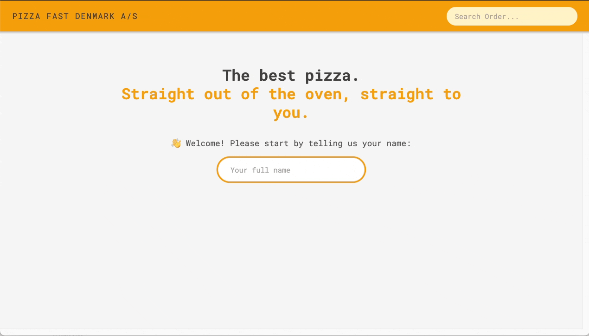

# Pizza Fast Denmark A/S

Pizza Fast Denmark is a modern web application for ordering pizzas, built using React, Vite, TypeScript, and Tailwind CSS. This project demonstrates the creation of a responsive, type-safe application with a fast development and build process.

## Live Demo

[🍕Pizza Fast Denmark A/S](https://pizza-fast-shop-ten.vercel.app/)

## Technologies and Techniques Used

 Core library for building user interfaces.  
 Fast build tool for a more efficient development experience.  
 Adds static typing for improved code quality.  
 Utility-first CSS framework for rapid styling.  
 For routing and navigation within the application.  
 For state management, store configuration, and connecting React components.

## Visual Overview

## Features

- **Pizza Menu:** Browse various pizzas with detailed descriptions and customization options.
- **Order Management:** Add, update, and remove items from the cart with TypeScript type safety.
- **Order Placement:** Complete orders with a form, including robust error handling for invalid input.
- **User State Management:** Persistent user state with Redux Toolkit, covering authentication and order history.
- **Priority Order Modification:** Allow modify order priorities even after submission.
- **Responsive Design:** Optimized for both desktop and mobile devices.
- **Loading and Error Handling:** Integrated indicators and error messages for a smooth user experience.
- **Type Safety:** Strongly typed components and state management using TypeScript.

## More Projects...

- [WordWise](https://github.com/YuejiaoShi/WordWise/) - Travel-Tracking and City-Mapping app
- [usePopCorn](https://github.com/YuejiaoShi/movie-app) - Movie Exploration and Management app
- [Recipestic](https://github.com/YuejiaoShi/recipe-app) - Recipe Manager with Timer & Customization app
